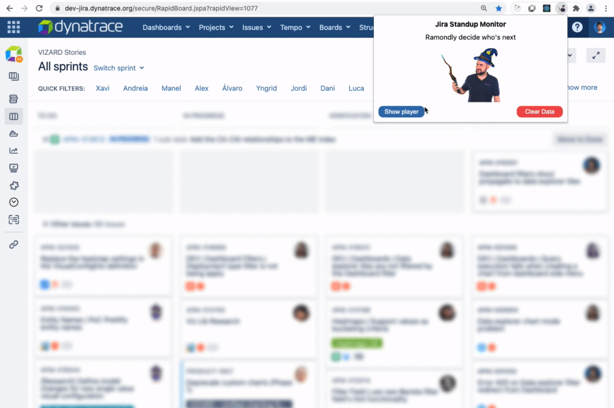
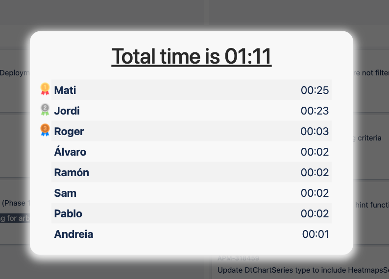

# Jira Standup Monitor 

Ramondly decides who's next on standups

## Installation
- Clone the repository
- Go to chrome://extensions/
- Toggle on the "Developer mode" switch on the top right menu
- Click on the "Load unpacked" button on the top left and choose the folder of the cloned repository
- (Optional) Pin the extension for easy access

That's it, you are ready to use it :)

## User Guide
 - Go to https://dev-jira.dynatrace.org/secure/RapidBoard.jspa
 - Check all the team members are on a quick filter label
 - Open the extension.
 - Click Start or next button to randomly select the following speaker.
 - Repeat the process until everyone talked and the "Show results" button is visible.
 - Click "Show results" to see the times spent for everyone.
 - Click "Clear data" to reset everything so you can start again.

## CHANGELOG
See changes [here](CHANGELOG.md)
