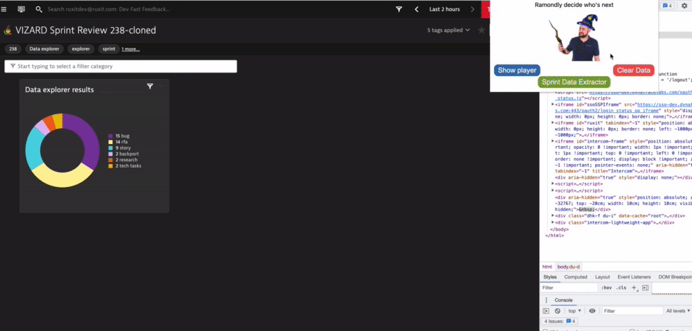

# Jira Standup Monitor 

Ramondly decides who's next on standups

## Installation
- Clone the repository
- Go to chrome://extensions/
- Toggle on the "Developer mode" switch on the top right menu
- Click on the "Load unpacked" button on the top left and choose the folder of the cloned repository
- (Optional) Pin the extension for easy access

That's it, you are ready to use it :)

## User Guide Jira Standup Monitor
 - Go to https://dev-jira.dynatrace.org/secure/RapidBoard.jspa
 - Check all the team members are on a quick filter label
 - Open the extension.
 - Click "Show player" to display the player on top of the JIRA board.
 - A player with the functions (postpone, previous, start/show results, next, skip) will appear
 - At any moment, you can click on "Clear data" to reset everything so you can start again.

## User Guide Sprint Data Extractor
 - Go to the https://dev-jira.dynatrace.org Backlog
 - Identify the title of the sprint you want to extract the data(such as Dynatrace Sprint 239)
 - Open the extension and click on Sprint Data Extractor
 - Type the sprint title on the input and click any of the buttons to each functionality
   - Copy title => Summary of the counts of each task type*
   - Copy features => Features splitted by epic*
   - Copy researches*
   - Copy backports => Backports to production*
   - Copy Metric HTTP Post => curl command to generate the data of the pie chart summary
     - Before executing that command, you will need to set your token variable
       - `export DEMO_DEV_TOKEN=WhateverValidTokenHash`
            

   - Copy All Dashboard => You will copy at once all the title, features, researches and backports
   - Paste All Dashboard => You can go to the demo.dev dashboard and paste the dashboard you just copied

*Every text is already formatted

## CHANGELOG
See changes [here](CHANGELOG.md)
